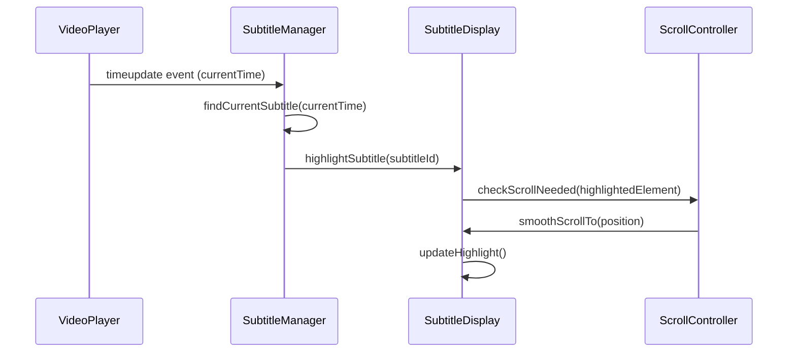
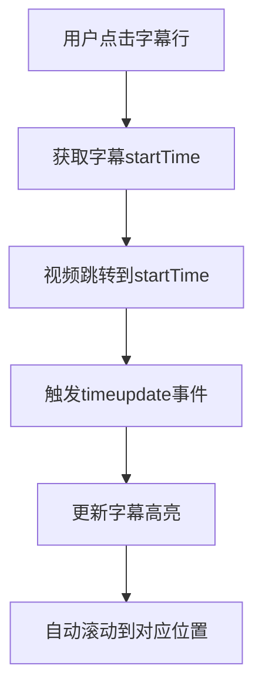
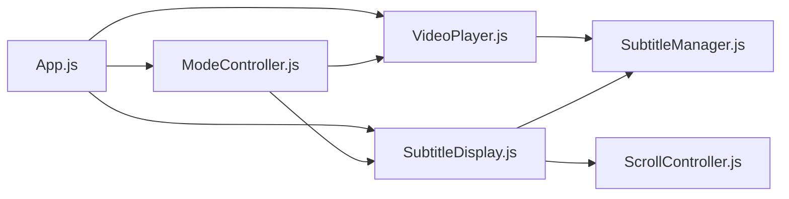

# 英语口语学习滚动字幕应用 - 产品需求文档 (PRD)

## 产品概述

**产品名称**: 英语口语学习滚动字幕应用
**产品定位**: 通过国外博主Vlog视频，提供沉浸式英语口语学习体验
**目标用户**: 想要提高英语口语的成人学习者
**产品类型**: Web应用

## 产品路线图

### V1: 最小可行产品 (MVP)

**核心功能清单：**
- **视频播放器** - 支持常见视频格式播放
- **字幕同步高亮** - 实时根据视频播放进度高亮对应字幕行
- **字幕自动滚动** - 高亮字幕行始终保持在可视区域内，平滑滚动
- **点击定位功能** - 点击任意字幕行，视频跳转到对应时间点
- **中英字幕切换** - 支持纯英文和中英对照两种显示模式
- **点读模式** - 单句循环播放，播完当前句不自动切换
- **基础播放控制** - 播放/暂停、进度条、音量控制

### V2 及以后版本 (Future Releases)

**V2.0 增强学习功能：✅ 已实现**
- **播放速度调节** ✅ - 0.5x-2.0x变速播放，适应不同学习节奏
- **重复播放模式** ✅ - 字幕重复播放2-10次，强化记忆效果
- **现代化播放控件** ✅ - 悬浮居中设计，毛玻璃效果
- **16:9视频比例优化** ✅ - 标准比例显示，视觉和谐
- **布局优化** ✅ - 标题栏、简介栏、字幕宽度优化

**V2.1 学习功能扩展：**
- **词汇标记系统** - 点击单词查看释义，标记生词
- **学习进度跟踪** - 记录学习时长、完成进度
- **字幕搜索功能** - 全文搜索特定词汇或句子
- **听写模式** - 隐藏字幕进行听力训练

**V2.2 内容管理：**
- **多视频管理** - 视频库、分类、收藏功能
- **离线下载** - 支持视频和字幕离线缓存
- **视频推荐** - 基于学习水平的智能推荐

**V3.0 互动学习：**
- **语音跟读功能** - 录音对比，发音纠正
- **学习统计分析** - 词汇掌握度、学习报告
- **社区功能** - 学习笔记分享、讨论区

## 关键业务逻辑 (Business Rules)

### 1. 字幕同步高亮逻辑
- 每个字幕条目包含开始时间(startTime)和结束时间(endTime)
- 视频播放时，实时检查当前播放时间，匹配对应的字幕条目
- 当前时间 >= startTime 且 < endTime 的字幕行设为高亮状态
- 支持字幕时间偏移调整，应对音视频不同步问题

### 2. 自动滚动算法
- 高亮字幕行需始终保持在字幕容器的可视区域内
- 当高亮行接近容器底部时，触发向上滚动
- 滚动采用平滑动画，避免突兀跳跃
- 滚动速度与视频播放速度联动

### 3. 点击定位规则
- 点击字幕行时，获取该行的startTime
- 视频跳转到startTime位置并开始播放
- 同步更新字幕高亮状态
- 自动滚动到对应位置

### 4. 点读模式逻辑
- 激活点读模式后，视频播放到当前句结束时暂停
- 不自动切换到下一句高亮
- 用户需手动点击下一句或关闭点读模式继续播放

## 数据契约 (Data Contract)

### 1. 视频数据格式
```
支持格式: MP4, WebM, OGV
编码要求: H.264/VP8/VP9 视频编码，AAC/MP3 音频编码
分辨率: 720P-4K，自适应播放
```

### 2. 字幕数据结构
```json
{
  "videoId": "unique_video_identifier",
  "language": "en",
  "subtitles": [
    {
      "id": 1,
      "startTime": 0.0,
      "endTime": 3.5,
      "text": "Hello everyone, welcome to my channel!",
      "translation": "大家好，欢迎来到我的频道！"
    }
  ]
}
```

### 3. 配置数据
```json
{
  "playbackSettings": {
    "autoScroll": true,
    "highlightDelay": 0,
    "scrollOffset": 100
  },
  "displaySettings": {
    "showTranslation": false,
    "readingMode": false,
    "fontSize": "medium"
  }
}
```

### 4. 时间轴精度要求
- 字幕时间精确到毫秒级 (0.001s)
- 支持SRT、VTT标准字幕格式导入
- 时间偏移范围：±5秒

## MVP 原型设计

```
┌─────────────────────────────────────────────────────────────────────────────┐
│                        英语口语学习滚动字幕应用 MVP                           │
├─────────────────────────────────────────────────────────────────────────────┤
│                                                                             │
│  ┌─────────────────────────────────┐  ┌───────────────────────────────────┐ │
│  │                                 │  │ 字幕控制区                        │ │
│  │                                 │  │ ┌─────┐ ┌─────┐ ┌─────┐ ┌─────┐ │ │
│  │                                 │  │ │中英文│ │点读模│ │同步高│ │自动滚│ │ │
│  │         视频播放区              │  │ │切换 │ │式  │ │亮  │ │动  │ │ │
│  │      (720P-4K自适应)            │  │ └─────┘ └─────┘ └─────┘ └─────┘ │ │
│  │                                 │  └───────────────────────────────────┘ │
│  │                                 │                                        │
│  │                                 │  ┌───────────────────────────────────┐ │
│  │                                 │  │ 字幕显示区 (可滚动)                │ │
│  │                                 │  │                                   │ │
│  │                                 │  │ [00:01] Hello everyone!           │ │
│  │                                 │  │         大家好！                   │ │
│  │                                 │  │                                   │ │
│  └─────────────────────────────────┘  │ 【00:04】Welcome to my channel!   │ │
│                                        │          欢迎来到我的频道！        │ │
│  ┌─────────────────────────────────┐  │                                   │ │
│  │ ▶️ ⏸️  ⏮️ ⏭️  🔊 ━━━●━━━ 2:45/10:30 │  │ [00:08] Today I'm going to...     │ │
│  │      播放控制栏                  │  │         今天我将要...               │ │
│  └─────────────────────────────────┘  │                                   │ │
│                                        │ [00:12] show you something...     │ │
│                                        │         向你展示一些...             │ │
│                                        │                                   │ │
│                                        │ ▼ 更多字幕内容...                   │ │
│                                        └───────────────────────────────────┘ │
│                                                                             │
└─────────────────────────────────────────────────────────────────────────────┘

功能说明:
• 点击字幕行 → 视频跳转到对应时间
• 高亮行(【】标记) → 当前播放位置对应字幕
• 字幕区自动滚动 → 保持高亮行在可视区域
• 中英文切换 → 显示/隐藏中文翻译
• 点读模式 → 播放完当前句后暂停
```

## 架构设计蓝图

### 核心流程图

#### 字幕同步流程图


#### 点击定位流程图


### 组件交互说明

#### 核心模块结构
- **VideoPlayer.js** - 视频播放控制
- **SubtitleManager.js** - 字幕数据管理和同步逻辑
- **SubtitleDisplay.js** - 字幕UI渲染和交互
- **ScrollController.js** - 自动滚动算法
- **ModeController.js** - 点读模式、中英文切换控制

#### 模块依赖关系


### 技术选型与风险

#### 技术栈选择
- **前端框架**: React 18 + TypeScript
- **视频播放**: HTML5 Video API + Video.js (增强功能)
- **状态管理**: React Context + useReducer
- **样式方案**: CSS Modules + Tailwind CSS
- **构建工具**: Vite
- **字幕解析**: 自研SRT/VTT解析器

#### 潜在技术风险

🔴 **高风险**
- 视频格式兼容性问题 → 解决方案：转码服务预处理
- 字幕同步精度不足 → 解决方案：毫秒级时间戳，缓冲区优化

🟡 **中风险**
- 大字幕文件性能问题 → 解决方案：虚拟滚动，懒加载
- 移动端自动滚动卡顿 → 解决方案：使用transform3d，降低滚动频率

🟢 **低风险**
- 浏览器兼容性 → 现代浏览器支持良好
- 字幕格式解析 → 标准格式，成熟方案

## 最终确认

本PRD文档已完成MVP版本的完整规划，包含：
- ✅ 产品路线图 (V1 MVP + 未来版本规划)
- ✅ 核心功能清单和业务逻辑
- ✅ 数据契约和技术架构
- ✅ MVP原型设计图
- ✅ 技术选型和风险评估

**下一步行动**: 等待最终确认，准备进入开发阶段。

## 部署与运维

### 部署架构

#### 生产环境 (v1.6.0)
- **部署平台**: Vercel
- **技术栈**: Vite + React + TypeScript (纯前端)
- **访问地址**: https://youtube-english-new.vercel.app
- **部署方式**: Git Push 自动触发部署

#### 架构简化历程
**初始架构 (v1.5.0)**
- Next.js + Supabase + Redis + TailwindCSS + Cloudflare Stream
- 复杂的全栈架构，包含数据库和缓存

**最终架构 (v1.6.0)**
- Vite + React + TypeScript + 原生 CSS
- 纯前端静态部署，无服务器依赖

### 部署问题解决记录

#### 主要问题及解决方案

1. **supabaseKey is required 错误**
   - **问题描述**: 缺少 Supabase 环境变量导致应用无法启动
   - **影响范围**: 整个应用无法访问
   - **解决方案**: 移除 Supabase 依赖，简化为纯前端应用
   - **风险等级**: 🔴 高风险

2. **构建工具依赖缺失**
   - **问题描述**: Vercel 构建时找不到 vite 命令
   - **影响范围**: 部署失败，无法生成静态文件
   - **解决方案**: 将构建工具移到 dependencies 确保生产环境可用
   - **风险等级**: 🟡 中风险

3. **SPA 路由配置错误**
   - **问题描述**: JavaScript 模块 MIME 类型错误，页面无法加载
   - **影响范围**: 前端资源加载失败
   - **解决方案**: 使用 rewrites 替代 routes 配置
   - **风险等级**: 🟡 中风险

### 运维监控

#### 性能指标
- **构建时间**: ~30s (优化后)
- **首屏加载**: ~2s (静态资源)
- **视频加载**: 依赖网络环境
- **内存占用**: 纯前端，客户端渲染

#### 监控方案
- **可用性**: Vercel 内置监控
- **性能**: 浏览器性能 API
- **错误**: 客户端错误日志
- **用户体验**: Core Web Vitals

### 技术债务管理

#### 已解决的技术债务
- ✅ 移除不必要的后端依赖
- ✅ 简化构建配置
- ✅ 统一技术栈
- ✅ 优化部署流程

#### 未来优化方向
- 📈 添加性能监控
- 📈 实现 PWA 功能
- 📈 优化移动端体验
- 📈 添加错误边界处理

## V2.0 实现记录 (2025-09-23) 🚀

### 核心学习功能升级

#### 1. 播放速度控制系统
**实现功能**：
- 支持6种播放速度：0.5x、0.75x、1x、1.25x、1.5x、2x
- 实时调整，无需暂停视频
- 现代化胶囊式选择器设计
- 毛玻璃效果，悬停动效

**技术实现**：
```typescript
// VideoPlayer.tsx - 接口扩展
setPlaybackRate: (rate: number) => void
getPlaybackRate: () => number

// VideoControls.tsx - UI组件
const playbackRateOptions = [0.5, 0.75, 1, 1.25, 1.5, 2];
```

#### 2. 重复播放模式
**实现功能**：
- 字幕重复播放：2、3、5、10次可选
- 实时进度显示："第 N/M 次"
- 智能时间检测，精确控制
- 模式切换自动清理状态

**技术实现**：
```typescript
// 状态管理
const [repeatMode, setRepeatMode] = useState(false);
const [repeatCount, setRepeatCount] = useState(3);
const [currentRepeatCount, setCurrentRepeatCount] = useState(0);

// 重复逻辑
if (repeatMode && repeatSubtitle && current >= repeatSubtitle.endTime) {
  if (currentRepeatCount < repeatCount) {
    setCurrentRepeatCount(prev => prev + 1);
    video.currentTime = repeatSubtitle.startTime;
  }
}
```

### 界面设计重大升级

#### 3. 现代化播放控件
**设计特点**：
- 悬浮居中设计，不遮挡视频内容
- 半透明黑色渐变背景
- 智能显示：悬停显示，默认隐藏
- 圆形播放按钮，48×48px

**视觉效果**：
- 毛玻璃效果：`backdrop-filter: blur(8px)`
- 多层阴影：`box-shadow: 0 4px 12px rgba(0,0,0,0.3)`
- 缩放动效：hover时scale(1.1)
- 渐变进度条：主题色线性渐变

#### 4. 布局架构优化
**新增组件**：
- `VideoHeader.tsx` - 视频标题栏
- `VideoDescription.tsx` - 视频简介栏
- 优化后的 `VideoControls.tsx`

**布局改进**：
- 16:9视频比例：`aspect-ratio: 16 / 9`
- 字幕宽度：450px → 500px
- 响应式设计，移动端适配

### 用户体验提升

#### 5. 交互体验优化
**控件交互**：
- 悬停显示控件，避免界面干扰
- 触摸友好的移动端适配
- 平滑动画，微交互反馈

**视觉和谐**：
- 主题色一致性：蓝色系设计
- 圆角统一：12px标准圆角
- 阴影层次：营造立体视觉效果

**学习体验**：
- 变速播放适应不同学习节奏
- 重复播放强化记忆效果
- 字幕宽度优化提升阅读体验

### 技术架构升级

#### 6. 组件化重构
**架构优化**：
```
VideoHeader (标题栏)
├── 视频标题、时长、难度
└── 学习进度显示

VideoPlayer (播放器)
├── 16:9比例视频容器
└── 悬浮播放控件

VideoDescription (简介栏)
└── 视频描述信息

SubtitleSection (字幕区)
├── 控制按钮区
└── 优化宽度字幕列表
```

**状态管理扩展**：
- 播放速度控制状态
- 重复播放模式状态
- 视频信息数据管理

#### 7. 响应式设计完善
**桌面端优化**：
- 控件宽度：90%，最大800px
- 按钮尺寸：48×48px
- 进度条高度：8px → hover 10px

**移动端适配**：
- 控件宽度：95%
- 按钮尺寸：44×44px
- 进度条加厚：10px → hover 12px
- 字体大小适配小屏幕

---
*文档创建时间: 2025-09-22*
*最后更新: 2025-09-23*
*版本: v2.0*
*产品设计师: Claude*